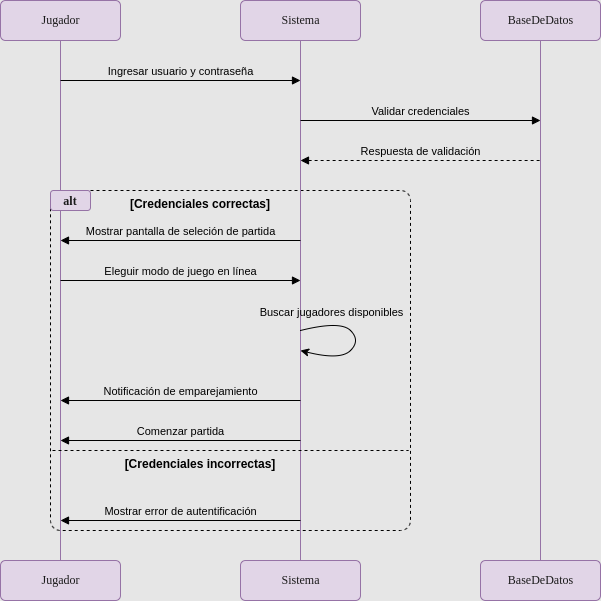

# Diagrama de secuencia

## Sistema de Videojuegos en Línea

    El jugador ingresa su nombre de usuario y contraseña.
    El sistema valida las credenciales con la base de datos.
    Si las credenciales son correctas, el sistema muestra la pantalla de selección de partidas.
    El jugador elige una opción de juego en línea.
    El sistema busca jugadores disponibles y los empareja.
    Cuando se encuentra un grupo adecuado, el sistema notifica al jugador y comienza la partida.
